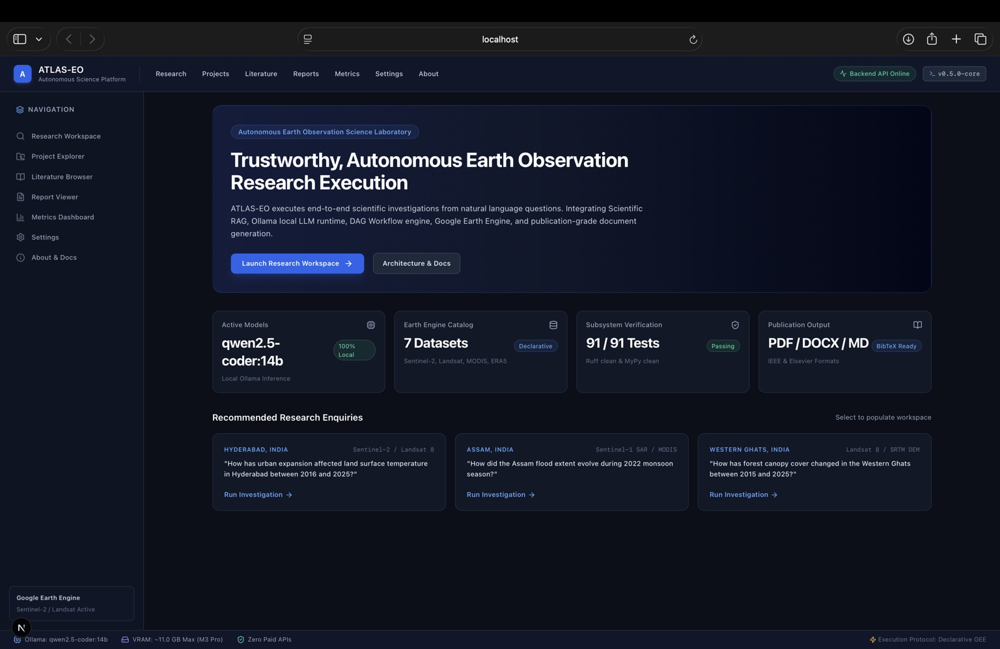
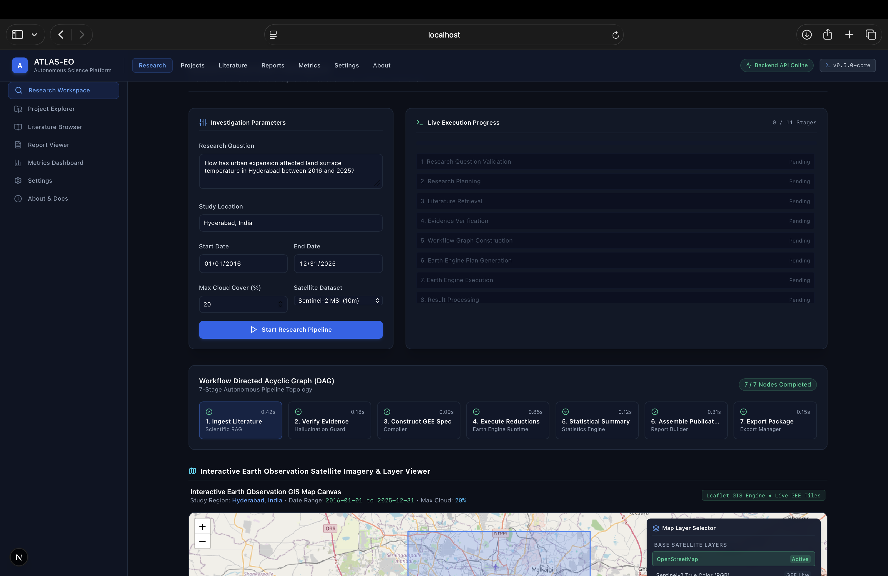
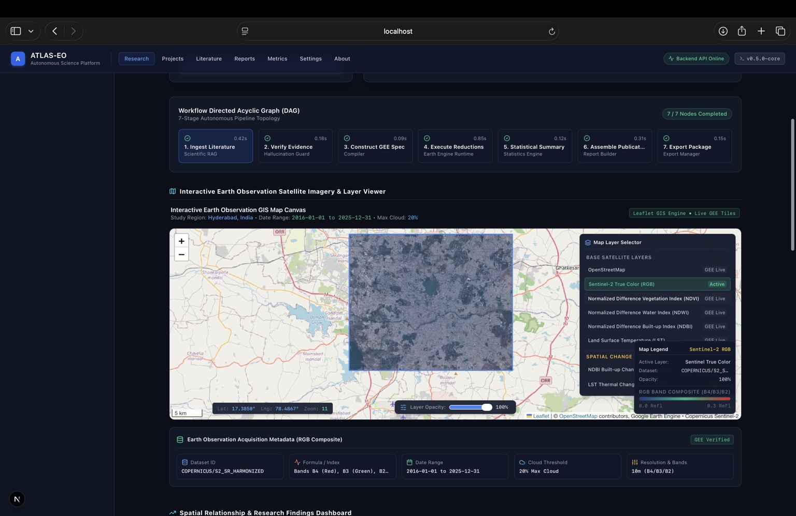
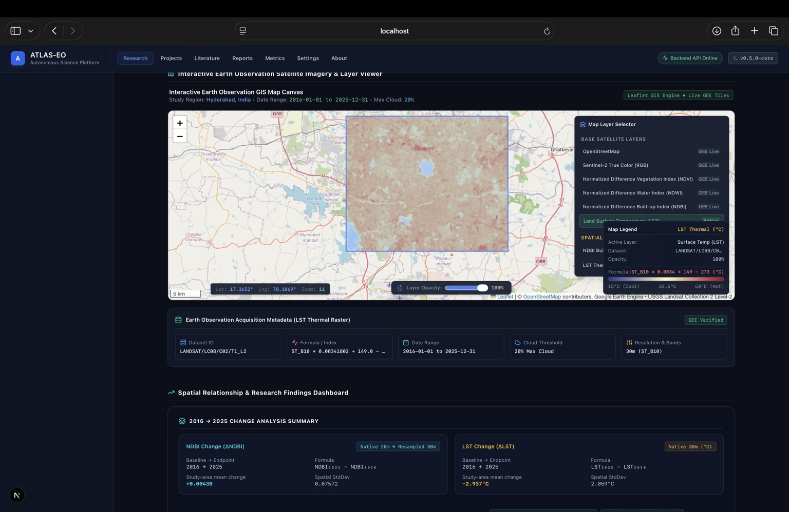
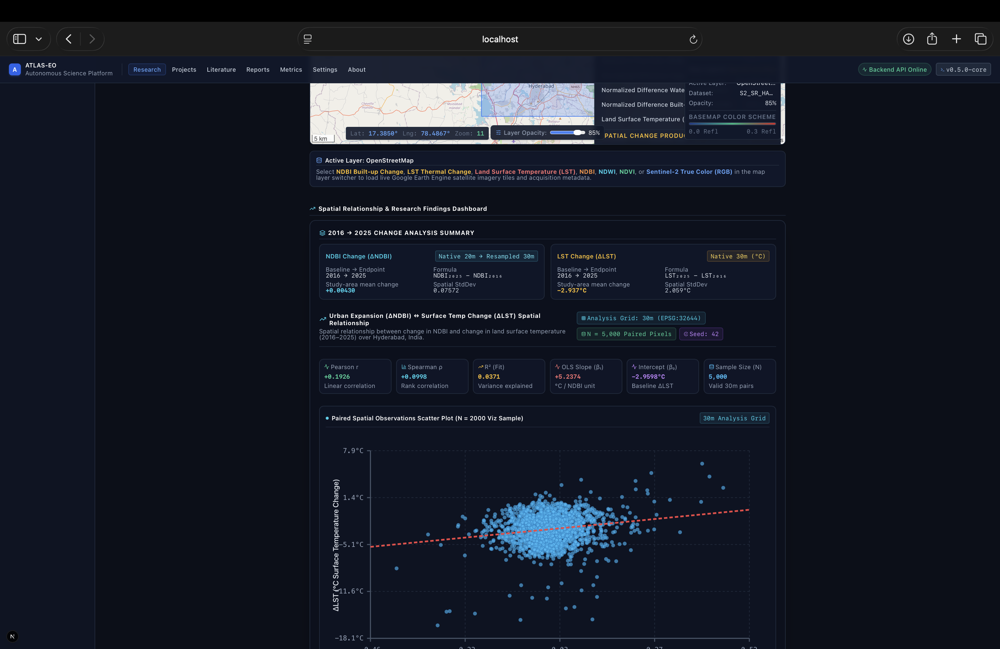
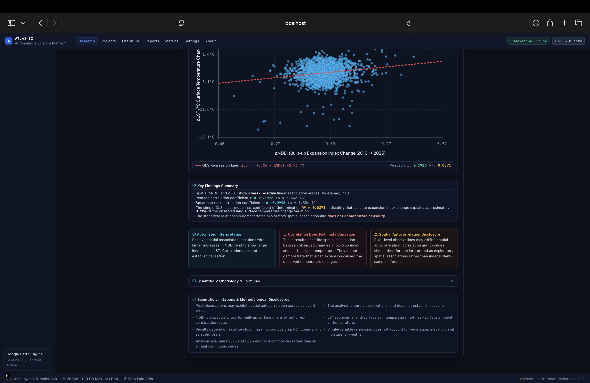
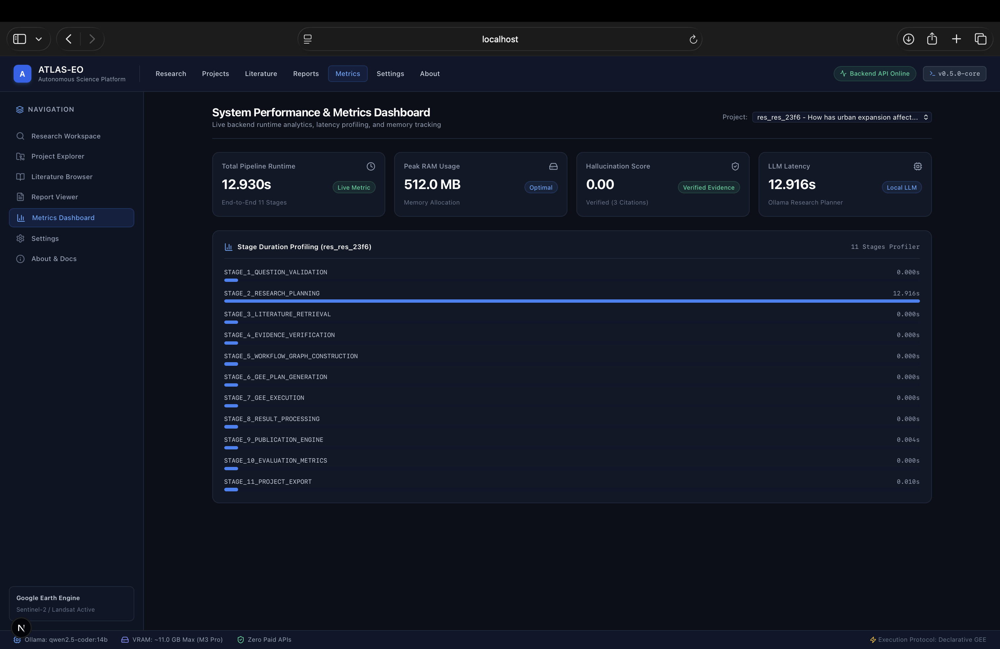
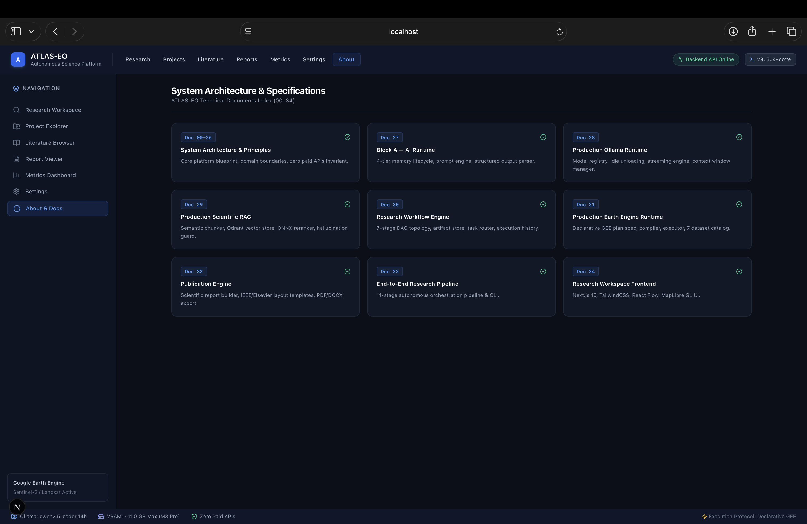
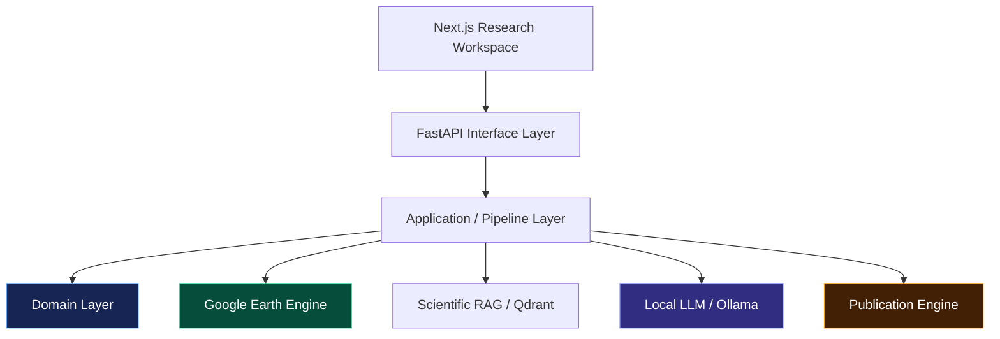

<div align="center">

# 🛰️ ATLAS-EO

### Autonomous Trustworthy Laboratory for Earth Observation Science

**An AI-native scientific research platform that turns natural-language questions into reproducible Earth Observation investigations.**

<p>
  
  
  
  
  
  
  
  
</p>

<p>
  <a href="#-what-is-atlas-eo">Overview</a> •
  <a href="#-why-atlas-eo">Why ATLAS-EO</a> •
  <a href="#-product-preview">Preview</a> •
  <a href="#-how-a-research-question-becomes-a-result">Pipeline</a> •
  <a href="#-architecture">Architecture</a> •
  <a href="#-quick-start">Quick Start</a> •
  <a href="#-documentation">Docs</a>
</p>

</div>

---

## 🌍 What is ATLAS-EO?

**ATLAS-EO** is an open-source, AI-native scientific laboratory built specifically for **Earth Observation research**.

Instead of treating a research question as a chat prompt, ATLAS-EO treats it as an **executable scientific investigation**.

A researcher can ask a question such as:

> **“How has urban expansion affected land surface temperature in Hyderabad between 2016 and 2025?”**

ATLAS-EO can orchestrate the research workflow across:

- 🔬 **Scientific literature retrieval**
- 🧠 **Local LLM-based research planning**
- 🛡️ **Evidence verification and hallucination controls**
- 🛰️ **Google Earth Engine satellite analysis**
- 🗺️ **Interactive geospatial visualization**
- 📐 **Spatial statistics and regression**
- 📊 **Execution metrics and stage profiling**
- 📝 **Publication-grade report generation**
- 🔁 **Reproducible execution metadata**

The goal is simple:

> **Move from “ask an AI about Earth observation” to “execute an auditable Earth observation study.”**

---

## ✨ Why ATLAS-EO?

Generic AI systems can produce plausible scientific explanations.

ATLAS-EO is designed around a different principle:

### **The answer should be traceable to an execution.**

A typical investigation can preserve:

**Research Question → Plan → Evidence → Dataset → Earth Engine Execution → Statistics → Interpretation → Report**

This gives the system a research-oriented foundation rather than a chatbot-oriented one.

### Core principles

| Principle | ATLAS-EO approach |
|---|---|
| **Reproducibility** | Research parameters, execution state and generated artifacts are preserved |
| **Scientific evidence** | Literature and claims move through verification stages |
| **Local-first AI** | LLM execution can run locally through Ollama |
| **Real EO computation** | Google Earth Engine is used for satellite processing |
| **Spatial analysis** | Pixel-level paired observations can be analyzed on a projected metric grid |
| **Transparency** | Pipeline stages, runtime and statistical outputs are exposed |
| **Architecture** | Clean Architecture + Domain-Driven Design boundaries |
| **Publication** | Results can be assembled into structured scientific reports |

---

# 🖥️ Product Preview

The interface is designed as a **scientific workspace**, not a generic admin dashboard.

## Research Command Center

The landing workspace brings the research question, active models, Earth Engine catalog and investigation entry points together.

<p align="center">
  
</p>

---

## Autonomous Research Workspace

A research question becomes an executable workflow with live stage progress, a DAG representation and the Earth Observation workspace.

<p align="center">
  
</p>

---

## 🗺️ Interactive Earth Observation

The workspace exposes satellite layers through an interactive GIS canvas, including Sentinel-2 imagery and derived Earth Observation layers.

<p align="center">
  
</p>

### Multiple EO products

The same research workspace can expose thermal and index-based products alongside the geographic context.

<p align="center">
  
</p>

---

## 📐 Spatial Relationship Analysis

ATLAS-EO can expose paired spatial observations and statistical relationships between Earth Observation variables.

The example below shows an urban-expansion / surface-temperature analysis using NDBI and LST change.

<p align="center">
  
</p>

The analysis workspace surfaces metrics such as:

- Pearson correlation
- Spearman rank correlation
- Coefficient of determination
- OLS slope and intercept
- Spatial sample size
- Change in NDBI
- Change in LST

The system also explicitly distinguishes **association from causation**.

<p align="center">
  
</p>

---

## ⚙️ Execution & Observability

Scientific software should expose not only its results, but also how the result was produced.

The metrics dashboard provides runtime and stage-level execution visibility.

<p align="center">
  
</p>

---

## 📚 Architecture & Technical Documentation

The application also exposes its technical specifications through the workspace.

<p align="center">
  
</p>

---

# 🔬 How a Research Question Becomes a Result

ATLAS-EO is organized around an executable research lifecycle:


### The important distinction

The LLM does not replace the scientific computation.

Instead:

```text
Local LLM
   │
   ├── plans the investigation
   ├── structures the workflow
   └── assists interpretation
          │
          ▼
Google Earth Engine
   │
   ├── retrieves satellite data
   ├── applies reductions
   ├── generates spatial products
   └── computes Earth Observation statistics
          │
          ▼
Scientific Report
   │
   ├── methods
   ├── results
   ├── statistics
   ├── limitations
   └── reproducibility metadata
```

This separation is central to the project's design.

---

# 🛰️ Earth Observation Capabilities

The current platform is focused on Earth Observation workflows including urban and environmental analysis.

The repository integrates Google Earth Engine workflows around datasets such as:

- **Sentinel-2 Surface Reflectance**
- **Landsat Collection 2**
- **MODIS**
- Additional catalog-backed Earth Observation datasets

The research interface exposes products such as:

- RGB composites
- NDVI
- NDWI
- NDBI
- Land Surface Temperature
- Change layers
- Spatial relationship analysis

For spatial statistical pairing, the platform supports projected metric-grid analysis rather than treating geographic degrees as uniform distances.

---

# 🧠 Local-First AI

ATLAS-EO is designed to support **local-first execution**.

LLM and embedding components can run through provider abstractions, allowing the application to avoid hard-wiring the scientific workflow to a single model vendor.

The repository currently uses an Ollama-compatible local runtime for model execution.

This design provides:

- Lower dependence on paid hosted inference
- Greater control over research inputs
- Swappable model providers
- Explicit runtime boundaries
- A path toward reproducible local experiments

---

# 🛡️ Scientific Trust & Reproducibility

Scientific automation is useful only when its output can be inspected.

ATLAS-EO therefore treats reproducibility as a first-class concern.

Generated research artifacts can retain metadata such as:

- Research UUID
- Research question
- Study region
- Date range
- Dataset configuration
- Cloud threshold
- Workflow version
- Report version
- Git commit SHA
- Execution runtime
- Pipeline stage history
- Statistical outputs

The publication pipeline is also designed so that report statistics are consumed from the execution artifact bundle rather than manually typed into the final report.

That means a generated report can be traced back to the computation that produced it.

---

# 🏗️ Architecture

ATLAS-EO follows **Clean Architecture** and **Domain-Driven Design** principles.

```text
ATLAS-EO
│
├── frontend/
│   └── Next.js research workspace
│
├── src/
│   ├── domain/
│   │   └── Pure scientific/business entities and contracts
│   │
│   ├── application/
│   │   ├── Pipeline orchestration
│   │   ├── Research workflows
│   │   ├── Publication engine
│   │   ├── Evaluation
│   │   └── Prompt / agent coordination
│   │
│   ├── infrastructure/
│   │   ├── Google Earth Engine
│   │   ├── Ollama / LLM runtime
│   │   ├── Scientific RAG
│   │   ├── Storage
│   │   └── External providers
│   │
│   ├── interfaces/
│   │   ├── FastAPI REST API
│   │   └── CLI / DTO boundaries
│   │
│   └── shared/
│       ├── Configuration
│       ├── Logging
│       └── Exceptions
│
├── tests/
│   ├── unit/
│   └── integration/
│
├── docs/
│   ├── adr/
│   └── technical specifications
│
└── docker-compose.yml
```

### Architectural boundary



The domain layer is intentionally kept independent from infrastructure concerns, while application services orchestrate the execution of scientific workflows.

---

# 🧩 Technology Stack

| Layer | Technology |
|---|---|
| Frontend | Next.js 15, React, TypeScript, Tailwind CSS |
| Backend | Python 3.13, FastAPI |
| Scientific EO | Google Earth Engine |
| Local LLM | Ollama |
| RAG / Retrieval | Qdrant + scientific retrieval pipeline |
| Data / Statistics | Python scientific stack |
| API | REST / FastAPI |
| Architecture | Clean Architecture + DDD |
| Testing | Pytest |
| Static analysis | MyPy |
| Linting | Ruff |
| Deployment | Docker / Docker Compose |
| Documentation | Markdown + ADRs |

---

# 🚀 Quick Start

## Prerequisites

- Python **3.13+**
- Docker & Docker Compose
- Git
- Google Earth Engine access for live EO execution

### Clone

```bash
git clone https://github.com/Devyash0601/Atlas.git
cd Atlas
```

### Automated setup

```bash
./scripts/setup.sh
```

### Start development services

```bash
make dev
```

Depending on the local configuration, the main services are exposed at:

```text
Frontend:       http://localhost:3000
FastAPI:        http://localhost:8000
Health:         http://localhost:8000/api/v1/health
Swagger / OpenAPI:
                http://localhost:8000/docs
```

---

# 🌍 Google Earth Engine Setup

Live Earth Observation execution requires Google Earth Engine credentials.

1. Create/configure a Google Cloud project with Earth Engine enabled.
2. Create a service account with the required permissions.
3. Store the credential JSON **outside the repository**.
4. Configure the environment:

```bash
GEE_PROJECT_ID=your-gee-project-id
GEE_SERVICE_ACCOUNT=your-service-account@your-project.iam.gserviceaccount.com
GOOGLE_APPLICATION_CREDENTIALS=/absolute/path/to/service-account.json
```

Never commit service-account credentials, private keys, tokens or `.env` secrets.

---

# 🧪 Verification & Development

The repository contains unit and integration coverage across the domain, application, infrastructure and interface layers.

Useful commands:

```bash
# Run the complete test suite
PYTHONPATH=. pytest

# Static type checking
python3 -m mypy src

# Lint
ruff check src/ tests/

# Frontend type checking
cd frontend
npx tsc --noEmit

# Production frontend build
npm run build
```

The current development verification run completed with:

```text
133 passed
```

alongside clean MyPy, Ruff and frontend verification during the latest correctness work.

---

# 📖 Documentation

The repository contains a substantial technical specification and architecture history.

Start with:

- [`docs/DEVELOPER_SETUP.md`](docs/DEVELOPER_SETUP.md) — development environment
- [`docs/CODING_WORKFLOW.md`](docs/CODING_WORKFLOW.md) — contribution workflow
- [`docs/CONTRIBUTING_GUIDE.md`](docs/CONTRIBUTING_GUIDE.md) — contribution guidance
- [`docs/FAQ.md`](docs/FAQ.md) — frequently asked questions
- [`docs/TROUBLESHOOTING.md`](docs/TROUBLESHOOTING.md) — troubleshooting
- [`docs/dependencies.md`](docs/dependencies.md) — dependency rationale
- [`docs/adr/`](docs/adr/) — architecture decision records

The application itself also exposes technical specifications through its **About & Docs** workspace.

---

# 🗺️ Project Status

ATLAS-EO v1.0.0 currently represents a substantial end-to-end platform milestone.

### Completed

- [x] Repository foundation and developer tooling
- [x] Clean Architecture / DDD foundation
- [x] Backend API layer
- [x] Frontend research workspace
- [x] Provider abstraction layer
- [x] Scientific RAG subsystem
- [x] Google Earth Engine integration
- [x] Projected metric-grid spatial analysis
- [x] Research workflow orchestration
- [x] Local LLM runtime integration
- [x] Scientific verification pipeline
- [x] Interactive Earth Observation visualization
- [x] Spatial statistical analysis
- [x] Publication/report generation
- [x] Runtime metrics and execution profiling
- [x] v1.0.0 release

### Direction

Future work can extend the platform toward:

- More EO sensors and products
- SAR-based analysis
- Larger-scale temporal studies
- More sophisticated causal / quasi-experimental methods
- Expanded scientific evaluation benchmarks
- Additional publication formats
- More research-domain-specific workflows

---

# ⚠️ Scientific Scope

ATLAS-EO is a **research execution platform**, not a replacement for scientific judgment.

Generated findings should be reviewed in context.

In particular:

- Correlation does not imply causation.
- Pixel-level observations may exhibit spatial autocorrelation.
- Satellite products have sensor-, resolution-, and cloud-masking limitations.
- Land Surface Temperature is not equivalent to near-surface air temperature.
- Single-variable statistical models do not capture every environmental confounder.
- Study conclusions depend on the selected ROI, dates, datasets and preprocessing choices.

The platform is designed to make these assumptions and limitations more visible rather than hiding them behind a fluent AI response.

---

# 📜 License

Distributed under the **MIT License**.

See [`LICENSE`](LICENSE) for details.

---

<div align="center">

### 🛰️ ATLAS-EO

**From research question → to Earth observation → to reproducible scientific result.**

<br>

Built for researchers, engineers, and anyone who wants scientific AI to be **executable, inspectable, and reproducible**.

<br>

⭐ If you find the project interesting, consider starring the repository.

</div>
