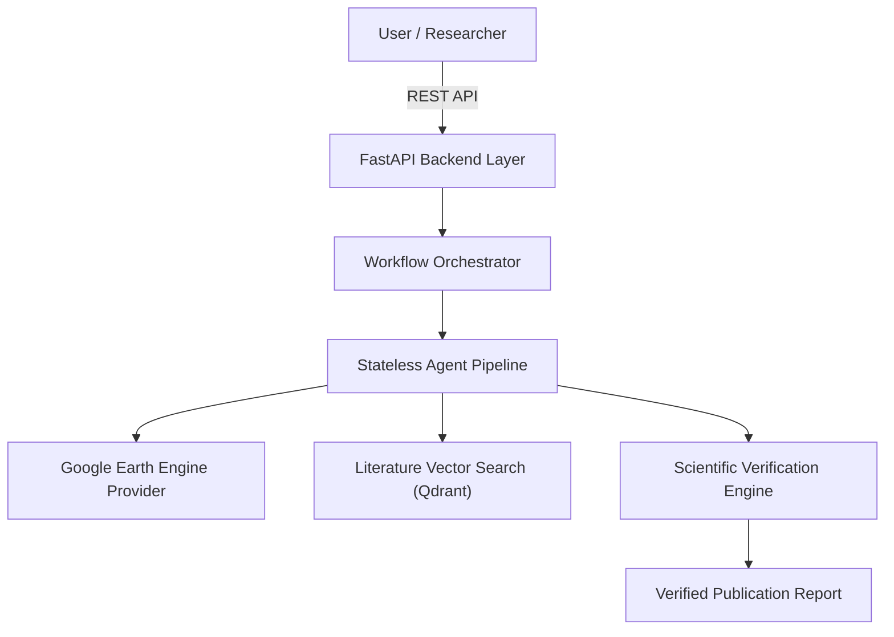

<div align="center">

# 🛰️ ATLAS-EO

**Autonomous Trustworthy Laboratory for Earth Observation Science**

[](https://github.com/atlas-eo/atlas-eo)
[](pyproject.toml)
[](https://fastapi.tiangolo.com)
[](https://nextjs.org)
[](LICENSE)
[](pyproject.toml)
[](docker-compose.yml)

<p align="center">
  <a href="#-overview">Overview</a> •
  <a href="#-key-features">Features</a> •
  <a href="#-architecture">Architecture</a> •
  <a href="#-quick-start">Quick Start</a> •
  <a href="#-developer-guide">Development</a> •
  <a href="#-documentation">Docs</a> •
  <a href="#-roadmap">Roadmap</a>
</p>

---

</div>

## 🌌 Overview

**ATLAS-EO** is an open-source, AI-native scientific laboratory platform specialized in Earth Observation. Unlike generic chatbots or superficial RAG wrappers, ATLAS-EO acts as a **trustworthy scientific reasoning system** designed to assist researchers in executing reproducible, transparent, and evidence-verified remote sensing studies.

Version 1 targets **Urban Heat Island (UHI)** analysis using Sentinel-2, Landsat Collection 2, MODIS, and Google Earth Engine.



---

## ✨ Key Features

- 🔬 **Scientific Verifiability**: Claims are categorized into `VERIFIED`, `PARTIAL`, or `UNSUPPORTED` backed by satellite evidence and citations.
- 🔄 **Strict Reproducibility**: Logged execution parameters and controlled randomness for scientific replication.
- 🧩 **Clean Architecture & DDD**: Pure business domain isolated from frameworks, databases, and AI SDKs.
- 🛡️ **Polymorphic Provider Abstraction**: LLMs (`qwen3:8b`), Embeddings (`nomic-embed-text`), and Vector Stores (`Qdrant`) run behind swappable provider contracts.
- 💻 **Local-First Execution**:Zero paid cloud LLM dependencies.

---

## 🏛️ System Architecture

ATLAS-EO follows Clean Architecture and Domain-Driven Design principles:

```text
atlas/
├── src/
│   ├── domain/          # Pure business entities & interfaces (Zero framework imports)
│   ├── application/     # Orchestrators, use cases & prompt templates
│   ├── infrastructure/  # PostgreSQL, Redis, Qdrant, Ollama & GEE integrations
│   ├── interfaces/      # FastAPI REST routers, DTO schemas & CLI
│   └── shared/          # Central settings, structlog JSON logging & exceptions
```

For detailed architectural diagrams, see [`docs/architecture/`](docs/architecture/):
- [System Architecture Diagram](docs/architecture/system.mmd)
- [Deployment Architecture Diagram](docs/architecture/deployment.mmd)
- [Agent Pipeline Diagram](docs/architecture/agents.mmd)

---

## 🚀 Quick Start

### 1. Prerequisites
- **Python**: 3.13+
- **Docker & Docker Compose**

### 2. Launching Infrastructure & Application

```bash
# Clone the repository
git clone https://github.com/atlas-eo/atlas-eo.git
cd atlas-eo

# Run automated setup script
./scripts/setup.sh

# Start containerized services via Makefile
make dev
```

Dashboard & Endpoint Services:
- **Frontend Dashboard**: `http://localhost:3000`
- **FastAPI Backend**: `http://localhost:8000/api/v1/health`
- **OpenAPI Swagger Docs**: `http://localhost:8000/docs`

---

## 🛠️ Developer Guide & Makefile Commands

ATLAS-EO includes a comprehensive automation suite via `Makefile` and `scripts/`:

```bash
make help          # View all available Makefile commands
make lint          # Run Ruff linter check
make typecheck     # Run MyPy strict type checker
make test          # Run Pytest suite
make verify        # Run complete quality gate verification (Linter + TypeCheck + Tests)
```

---

## 📚 Documentation & ADRs

- [Architecture Decision Records (ADRs)](docs/adr/)
- [Developer Setup Guide](docs/DEVELOPER_SETUP.md)
- [Coding Workflow](docs/CODING_WORKFLOW.md)
- [Dependency Rationale Audit](docs/dependencies.md)
- [Contributing Guide](docs/CONTRIBUTING_GUIDE.md)
- [FAQ](docs/FAQ.md) | [Troubleshooting](docs/TROUBLESHOOTING.md)

## 🔑 Google Earth Engine Credential Setup

1. Create/configure a Google Cloud project with Earth Engine enabled at [code.earthengine.google.com](https://code.earthengine.google.com/).
2. Create a service account in GCP IAM and download the JSON key.
3. Store the JSON file securely **OUTSIDE** the Git repository (e.g. `/path/to/atlas-earth-engine.json`).
4. Configure credentials in `.env`:
   ```bash
   GEE_PROJECT_ID=your-gee-project-id
   GEE_SERVICE_ACCOUNT=your-sa@your-project.iam.gserviceaccount.com
   GOOGLE_APPLICATION_CREDENTIALS=/absolute/path/to/service-account.json
   ```

---

## 🗺️ Roadmap & Phase Execution

- [x] **Phase 1**: Repository Initialization & API Foundation
- [x] **Phase 1.1**: Repository Hardening & Developer Tooling
- [x] **Phase 2**: Backend Foundation & Settings Loader
- [x] **Phase 3**: Frontend Navigation & Components
- [x] **Phase 4**: Database Layer & Alembic Migrations
- [x] **Phase 5**: Provider Interfaces (`LLMProvider`, `EarthEngineProvider`, etc.)
- [x] **Phase 6**: Literature RAG Pipeline
- [x] **Phase 7**: Google Earth Engine Subsystem & Projected 30m Metric Sampling
- [x] **Phase 8**: Agent Orchestration Engine
- [x] **Phase 9**: Vision Subsystem Integration
- [x] **Phase 10**: Scientific Verification, Research Dashboard & Release v1.0.0

---

## 📜 License

Distributed under the MIT License. See [`LICENSE`](LICENSE) for details.
